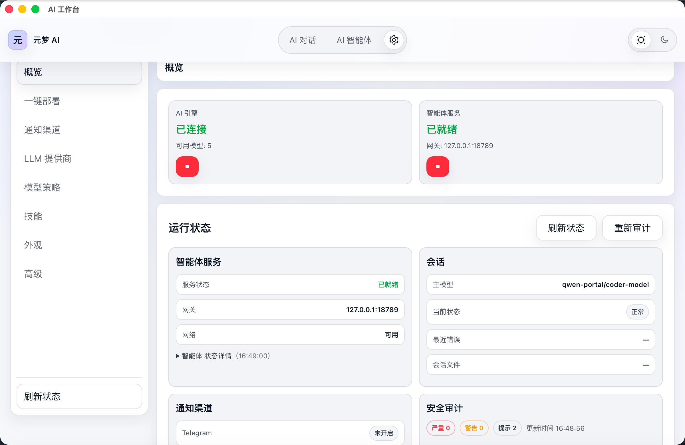

# ZeroAI Workbench（元梦AI）

本项目是一个「本地大模型 + 智能体」工作台，面向个人与小团队的私有化部署场景：以 Ollama 提供本地推理能力，以 OpenClaw 提供智能体与工作流能力，并在桌面端提供统一的管理面板与一键安装体验。

> 说明：本项目为第三方集成项目，并非 Ollama 或 OpenClaw 官方出品。

## 功能概览

- **管理面板**：统一查看 Ollama / OpenClaw 网关状态、会话与运行信息
- **一键安装（离线/本地）**：提供离线部署脚本入口（按你的离线包组织方式安装 Node、Ollama，并配置自启动）
- **智能体与工作流实践**：通过 OpenClaw 网关加载技能、编排工作流，落地到具体任务场景
- **本地模型对话**：基于 Ollama 的本地模型推理与模型管理（按项目实现为准）
- **通知渠道**：预留 Telegram / 飞书 等通知接入（按项目配置项与实现为准）

## 截图

将你的 APP 截图放到：

- `docs/screenshots/app.png`

README 会自动展示该图片：



## 快速开始（开发模式）

### 前置依赖

- Node.js（建议 22+）
- Ollama（本地模型服务）

### 安装依赖

```bash
npm install
```

### 启动 Web（Vite）

```bash
npm run dev
```

### 启动桌面端（Electron）

```bash
npm run dev:electron
```

## 一键安装（离线/本地）

项目内提供离线部署脚本入口：

- `scripts/agent-deploy.sh`

该脚本用于在本机安装/配置运行所需组件（例如 Node、Ollama，并使用 launchctl 配置自启动）。离线包内容与路径组织以你的实际发布物为准；公开仓库不提交 `resources/` 与 `release/` 等二进制目录。

## 工作流实践（示例方向）

下面给出推荐的实践方式（你可以结合自己的技能库/业务流程补充）：

- **本地优先**：默认使用 Ollama 本地模型完成日常任务，保证隐私与可用性
- **能力分层**：把“对话（Chat）/ 工具调用（Tools）/ 任务编排（Workflow）”拆开，避免所有逻辑都写在单个提示词里
- **可复用技能**：把常用能力沉淀为技能（如：文档总结、代码审查、日报生成、知识库检索），由 OpenClaw 统一管理

## 目录结构（核心）

- `src/`：前端管理面板（React + Vite）
- `electron/`：桌面端主进程/预加载
- `scripts/`：本地运行与打包脚本

## 致谢

- Ollama：本地大模型运行时
- OpenClaw：智能体与工作流能力
- 参考项目：openclaw-cn（中文增强版 OpenClaw，含国内网络优化与集成能力）

## License

MIT

